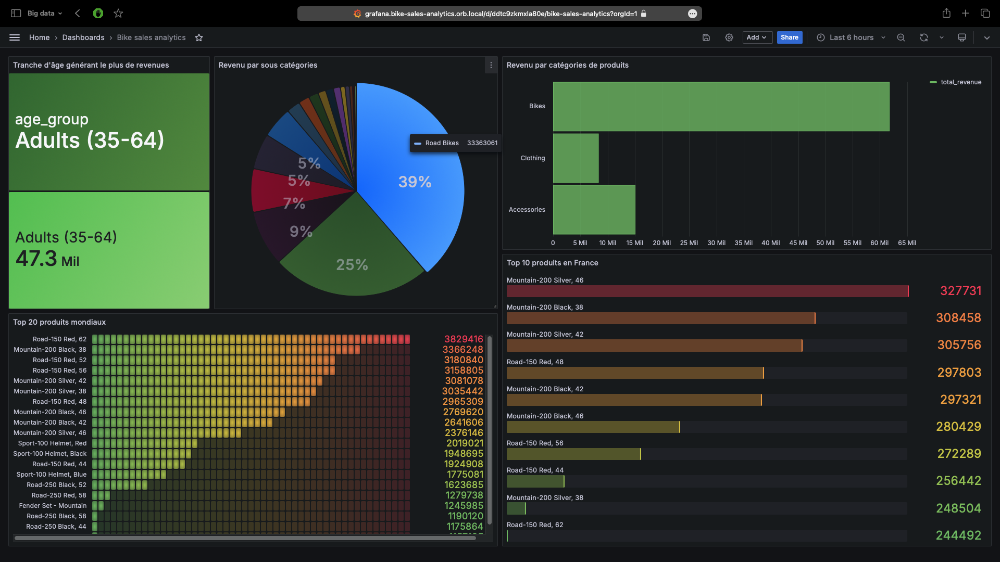
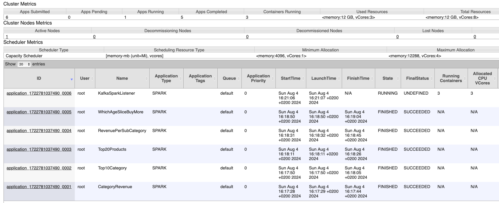
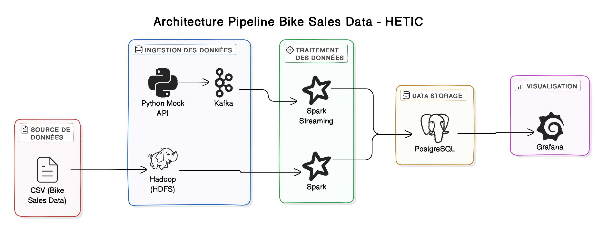

# Ventes de vélos en Europe

        

<p align="center">
  
  <br>
  <em>Screenshot du dashboard Bike Sales</em>
</p>

## Source de donnée

[Dataset des ventes de vélos en Europe](https://www.kaggle.com/datasets/sadiqshah/bike-sales-in-europe)

Ce dataset offre des données structurées, idéales pour nos besoins en traitement batch et streaming.

## Objectif

### Analyser un fichier de ventes

Voici une liste de question que nous voulons aborder:

1. Quel est le revenu réalisé pour chaque catégorie de produit ?
2. Quel est le revenu réalise pour chaque sous-catégorie de produit ?
3. Quel est le top 20 des produits générant le plus de revenu ?
4. Un top 10 des produits générant le plus de revenu en France ?
5. Quel tranche d'âge de client réalise le plus d'achats ?
6. En temps réel, combien de profit a été réalisé les 30 derniers jours ?

## Lancement

<p align="center">
  
  <br>
  <em>Votre rapport Hadoop si tout à run correctement.<br>http://localhost:8088/cluster/apps</em>
</p>

### Mise en place et lancement du projet

#### 1. Lancer le traitement en batch

```bash
source init.sh #ou ./init.sh 
```

#### Détails du script batch

- Pull l'image du cluster hadoop
- Lancer le docker compose contenant notre base de donnée PostgreSQL et le setup de l'application Grafana
- Déplacer les scripts Spark et les fichiers à traiter vers le cluster hadoop
- Lancer les scripts et alimenter la base de donnée

#### 2. Lancer le traitement en temps réel

```bash
source init-streaming.sh #ou ./init-streaming.sh

# Pour relancer manuellement:
# docker exec hadoop-master /bin/bash -c "spark-submit --jars /opt/spark/jars/postgresql-42.7.3.jar --packages org.apache.spark:spark-sql-kafka-0-10_2.12:3.1.2 /root/sales/spark_listener.py"
```

#### Détails du script streaming

- Lancer le docker compose stream contenent un serveur fastAPI (port:8000) pour produire des données et le cluster kafka
- Lancer le script d'écoute du producer kafka

<p align="center">
  
  <br>
  <em>Schéma de l'architecture (voir le détails dans le dossier tp00-pipeline-architecture)</a></em>
</p>

#### Visualiser les données traitées

Enfin, veuillez vous rendre sur [localhost:3000 dans le Dashboard](http://localhost:3000/d/ddtc9zkmxla80e/bike-sales-analytics?orgId=1) et vous connecter sur Grafana (username: admin, password: admin) afin d'avoir la visualisation des [questions](#objectif).

#### Comment produire des données en temps réel ?

```bash
# Client homme de 18 ans en Belgique achète un vélo de montagne MTB 1000 pour 250€, profit de 50€
curl --location 'localhost:8000/produce/' \
--header 'Content-Type: application/json' \
--data '{
           "Date": "2024-08-02",
           "Day": 2,
           "Month": 8,
           "Year": 2024,
           "Customer_Age": 18,
           "Age_Group": "Young Adults (25-34)",
           "Customer_Gender": "Male",
           "Country": "Belgium",
           "State": "California",
           "Product_Category": "Bikes",
           "Sub_Category": "Mountain Bikes",
           "Product": "MTB 1000",
           "Order_Quantity": 1,
           "Unit_Cost": 200.00,
           "Unit_Price": 250.00,
           "Profit": 50.00,
           "Cost": 200.00,
           "Revenue": 250.00
         }'
```

## Ressources

- L'image initial du cluster hadoop vient du [TP BigData de l'Ecole Centrale de Lyon](https://gitlab.ec-lyon.fr/sderrode/TP_BigData_ECL) proposé par Stéphane DERRODE.
- [Documentation pySpark](https://spark.apache.org/docs/latest/api/python/index.html)
- [Documentation Grafana](https://grafana.com/docs/grafana/latest/)

## Groupe

- Faustine CHARRIER
- Mattis ALMEIDA LIMA
- Louisan TCHITOULA
- Djédjé GBOBLE
- Julien HEITZ
